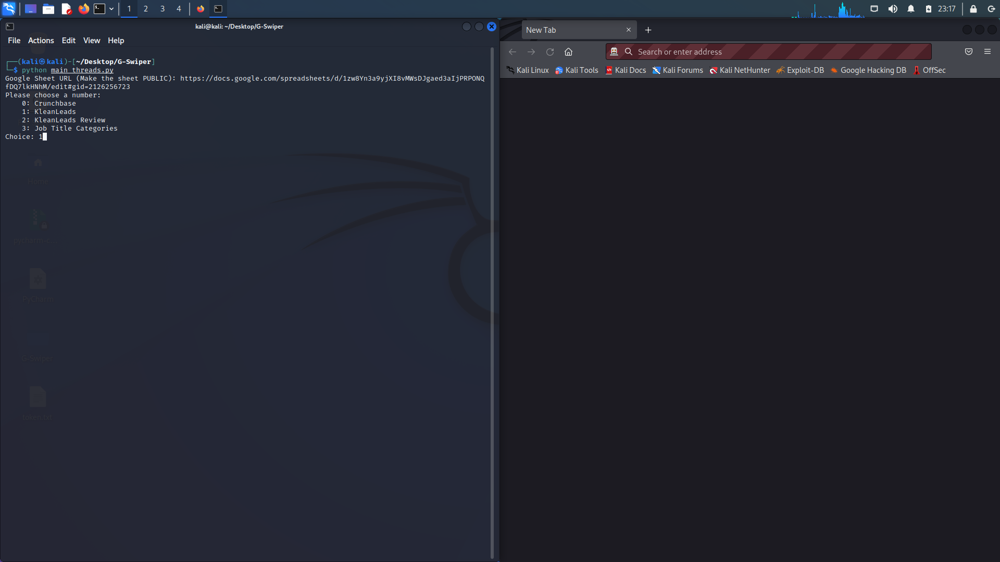
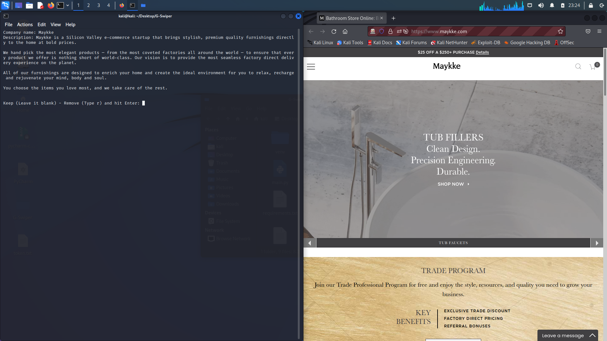

# G-Swiper

G-Swiper is a repository that helps you filter your sheets faster.

## Installation

```bash
pip install -r requirements.txt

pip install requests
pip install selenium
pip install gspread
```

You have to add the services_accont.json to this path ~/.config/gspread/
```bash
mv service_account.json ~/.config/gspread/service_account.json
```

## Usage

```python
python3 main_threads.py
```
## Screenshots





## License
[MIT](https://choosealicense.com/licenses/mit/)
